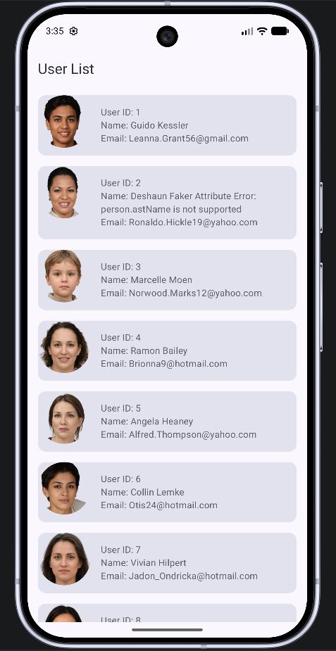
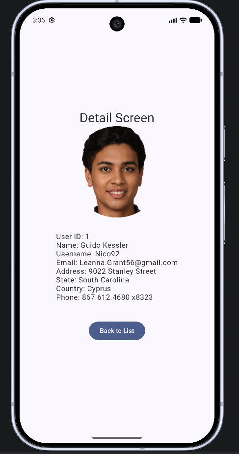

# ANZ User Directory Assignment

An Android application that demonstrates best practices in Android development, including Jetpack Compose, Hilt Dependency Injection, and MVVM architecture. The app fetches a list of users from a remote API and displays their details.

## Screenshots

  
  

## Features

- **User List**: Displays a list of users fetched from a REST API.
- **User Details**: Detailed view of a selected user, including profile picture and contact information.
- **Image Loading**: Efficient image loading and caching using Coil.
- **State Management**: Robust UI state handling (Loading, Success, Error) using Kotlin Flows and StateFlow.
- **Type-Safe Navigation**: Implementation of the new type-safe Compose Navigation.
- **Unit Testing**: Comprehensive unit tests for both ViewModels and Repositories.

## Tech Stack

- **UI**: [Jetpack Compose](https://developer.android.com/jetpack/compose) - Modern toolkit for building native UI.
- **Architecture**: MVVM (Model-View-ViewModel).
- **Dependency Injection**: [Hilt](https://developer.android.com/training/dependency-injection/hilt-android) - Standard DI library for Android.
- **Networking**: [Retrofit](https://square.github.io/retrofit/) - Type-safe HTTP client.
- **Serialization**: [Kotlin Serialization](https://kotlinlang.org/docs/serialization.html) & GSON.
- **Image Loading**: [Coil](https://coil-kt.github.io/coil/) - Kotlin-first image loading library.
- **Concurrency**: [Kotlin Coroutines & Flow](https://kotlinlang.org/docs/coroutines-overview.html) - For asynchronous programming.
- **Testing**: JUnit 4, Kotlin Coroutines Test, and custom Test Rules.

## Project Structure

- `com.assignment.anz.ui`: Compose-based UI components and screens.
- `com.assignment.anz.viewmodel`: ViewModel logic and UI state definitions.
- `com.assignment.anz.repository`: Repository implementations.
- `com.assignment.anz.network`: Retrofit API definitions.
- `com.assignment.anz.model`: Data models (POJOs).
- `com.assignment.anz.di`: Hilt modules for providing dependencies.

## Testing

The project includes unit tests for core business logic:
- **Repository Tests**: Verifies data fetching and error handling using fake API services.
- **ViewModel Tests**: Verifies UI state transitions and user interactions using fake repositories and injected test dispatchers.

## ⚙️ Setup Instructions

1. Clone the repository.
2. Open the project in **Android Studio**.
3. Sync Gradle and build the project.
4. Run the `app` module on an emulator or physical device.
